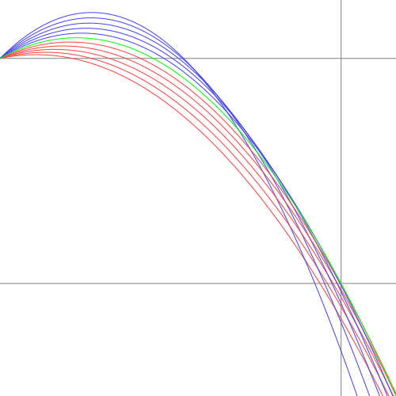

# cliff

Compute the optimum angle of projection from a cliff.

## The Problem Being Solved

I highly recommend throwing stones off a cliff when you're at the seaside. It's a lot of fun (although you do have to make sure there's nobody below you). This problem grew out of an argument I had with my family when we were at the seaside, that 45° isn't the best angle when you're on a cliff.

Let's suppose you're standing on a cliff at a height $h$ above the sea. You're capable of throwing a stone with velocity $v$ at any angle $\theta$ above the horizontal. What is the value of $\theta$ when the horizontal distance travelled $x$ is at a maximum before hitting the sea?

## The Solution

### Heuristic Answer

On level ground, when $h$ is zero, it's easy to show that $\theta$ needs to be midway between horizontal and vertical, and thus $\frac{\pi}{4}$ or 45°.

As $h$ increases, however, we can see by heuristic reasoning that $\theta$ decreases to zero, because you can put more of the velocity into the horizontal component as the height of the cliff begins to make up for the loss in the vertical component. For small negative values of $h$ (throwing up onto a platform), $\theta$ will actually be greater than 45°.

A picture is worth a thousand words:



The blue curve is the optimum one, and we can see that it starts off at an angle noticeably less than 45°. The green curves all start off at a greater angle, and would travel further on flat ground, but soon drop away below the blue curve. In contrast, the red curves start off at a lesser angle, and stay below the blue curve until after the desired height has been reached.

### Algebraic Answer

The equations of motion are:

$$
\begin{align}
x & =x_{0}+v\cos\theta\\,t & (1)\\
y & =y_{0}+v\sin\theta\\,t-\tfrac{1}{2}gt^{2} & (2)
\end{align}
$$

Setting $x_{0}=0$, $y_{0}=0$ and solving for $t$,

$$
t=\frac{x}{v\cos\theta}
$$

Substituting for $t$ in the equation for $y$,

$$
y=\tan\theta\\,x-\frac{g}{2v^{2}}\sec^{2}\theta\\,x^{2}
$$

This parabola describes the shape of the trajectory without reference to time. So, we can determine the horizontal displacement when the projectile reaches a vertical displacement of $-h$ by solving

$$
\begin{align}
-h=\tan\theta\\,x-\frac{g}{2v^{2}}\sec^{2}\theta\\,x^{2} & \qquad \quad (3)
\end{align}
$$

We could solve this for $x$, and maximize $x$ by taking the derivative, setting it to $0$ and solving again for $x.$ However, it's much simpler to use implicit differentiation and use the fact that $\frac{dx}{d\theta}=0$ to eliminate any terms involving $\frac{dx}{d\theta}$.

This gives us

$$
\begin{align}
0=\sec^{2}\theta\\,x-\frac{g}{v^{2}}\sec^{2}\theta\\,\tan\theta\\,x^{2} & \quad (4)
\end{align}
$$

If we assume $\sec\theta\ne0$ and $x\ne0$,

$$
\begin{align*}
1 & =\frac{g}{v^{2}}\tan\theta\\,x\\
x & =\frac{v^{2}}{g}\cot\theta
\end{align*}
$$

Substituting for $x$ in (3) gives

$$
\begin{align*}
-h & =\tan\theta\\,\frac{v^{2}}{g}\cot\theta-\frac{g}{2v^{2}}\sec^{2}\theta\\,\frac{v^{4}}{g^{2}}\cot^{2}\theta\\
 & =\frac{v^{2}}{g}\left(1-\frac{1}{2}\csc^{2}\theta\right)\\
\csc^{2}\theta & =2\left(1+\frac{gh}{v^{2}}\right)\\
\theta & =\arcsin\\,\frac{1}{\sqrt{2\left(1+\frac{gh}{v^{2}}\right)}}\\
 & =\arcsin\\,\frac{v}{\sqrt{2(v^{2}+gh)}}
\end{align*}
$$

### Alternative Approach

Instead of using implicit differentiation, we can make use of a physical argument to arrive at (4).

Let $d$ be the maximum horizontal distance than can be reached at height $-h$ and let $\theta$ be the angle that produces this.

If we vary the angle, the height at $d$ will always be less than or equal to $-h$.
If it was above $-h$, the projectile would travel further horizontally before descending to $-h$.
In other words, the vertical displacement $y$ at $x=d$ will be at a maximum when the angle is $\theta$, and setting $\frac{dy}{d\theta}=0$ produces equation (4).

### Further Discussion

This problem is the subject of a *Mathematics Stack Exchange* [question](https://math.stackexchange.com/questions/571/what-is-the-optimum-angle-of-projection-when-throwing-a-stone-off-a-cliff).

## The Program

The `cliffimg` program outputs an image of the problem to the file given on the command line. It can output SVG, PNG, PostScript or PDF. An example of the output is given above. Currently it doesn't take command line arguments to define the problem parameters, but this is planned as a future enhancement. However, it does take some options to check for various kinds of errors.

The program `cliff` is a GTK-based graphical program that displays the illustration in a window. Currently it doesn't take command line arguments to define the problem parameters, but this is planned as a future enhancement. A further enhancement will be to allow direct manipulation of the parameters by dragging lines.

The program `batch` is purely textual. It outputs a list of results for a range of velocities and heights, which it receives on `stdin`.

## Building

The `batch` command-line program has no dependencies and can be built using `make batch`. The `Makefile` also has a `check` target that compares the output of `batch` with a pre-stored version.

The `cliff` program depends on `gtkmm-3` and `cliffimg` uses `cairomm`.

The project uses an autotools build system and can be built with:

```shell
autoreconf -if
./configure
make
```

Nix files are provided, so a shell with dependencies can be started with:

```shell
nix develop -f shell.nix
```

Alternatively, the programs can be built using

```shell
nix build -f shell.nix
```
